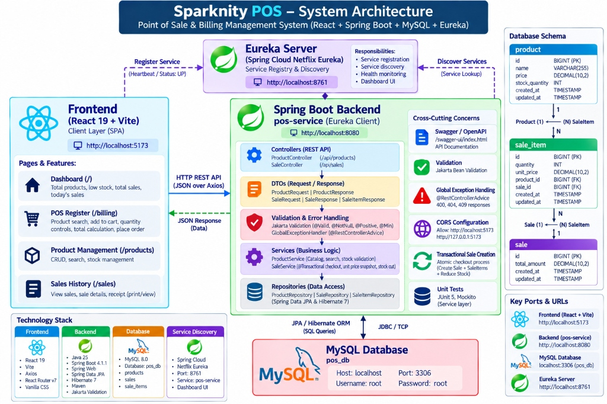
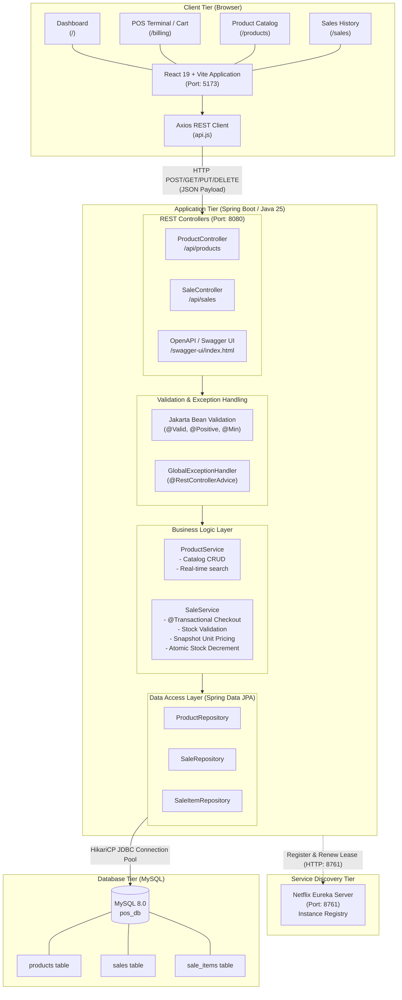
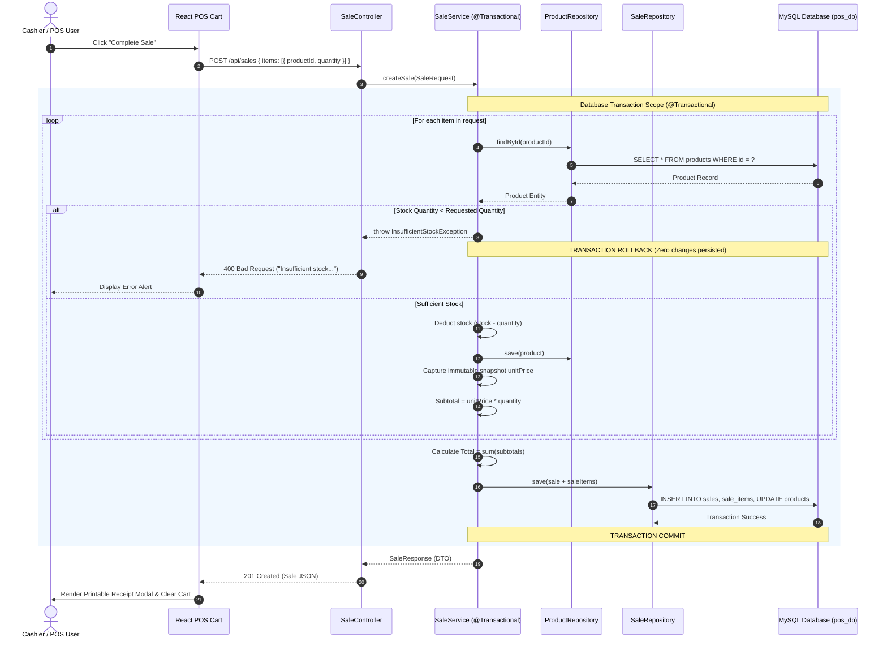
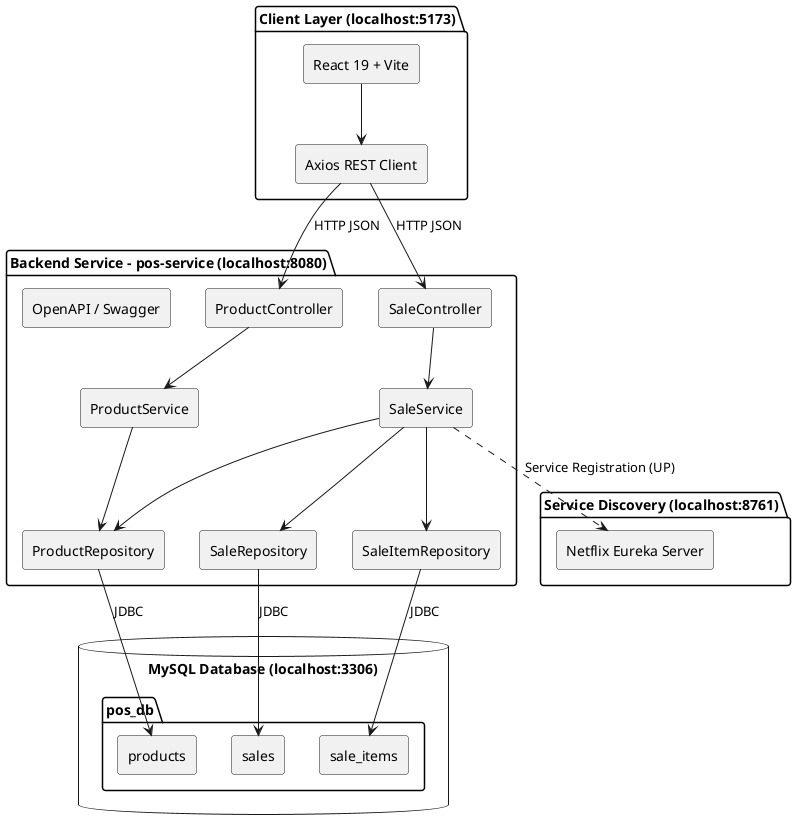

# Sparknity POS - System Architecture Specifications

This document outlines the complete architectural specifications, component boundaries, communication protocols, and data models for Sparknity POS. It includes ready-to-use Mermaid syntax, PlantUML diagrams, and prompt descriptions for visual diagram generation.

---

## 1. High-Level Architecture Overview

The system follows a decoupled, three-tier enterprise web architecture with client-side rendering, a transactional RESTful service layer, service discovery, and a relational database.



```text
+-----------------------------------------------------------------------------------+
|                                 CLIENT TIER                                       |
|                                                                                   |
|  React 19 + Vite (Port: 5173)                                                     |
|  +--------------------+  +--------------------+  +--------------------+           |
|  |     Dashboard      |  |    POS Register    |  |     Inventory      |           |
|  |   (/)              |  |    (/billing)      |  |    (/products)     |           |
|  +--------------------+  +--------------------+  +--------------------+           |
|  +--------------------+  +--------------------+                                   |
|  |   Sales History    |  |    Receipt Modal   |                                   |
|  |   (/sales)         |  |    (Print/View)    |                                   |
|  +--------------------+  +--------------------+                                   |
|                          |                                                        |
|                          +--------+ Axios HTTP Client (JSON over REST)            |
+-----------------------------------|-----------------------------------------------+
                                    |
                                    v
+-----------------------------------------------------------------------------------+
|                              APPLICATION TIER                                     |
|                                                                                   |
|  Spring Boot 4.1.1 (Java 25) - POS Service (Port: 8080)                           |
|                                                                                   |
|  [REST Controllers]                                                               |
|  - ProductController (/api/products)                                              |
|  - SaleController (/api/sales)                                                    |
|         |                                                                         |
|         v                                                                         |
|  [Validation & Error Handling]                                                    |
|  - Jakarta Validation (@Valid, @NotNull, @Positive, @Min)                         |
|  - GlobalExceptionHandler (@RestControllerAdvice)                                 |
|         |                                                                         |
|         v                                                                         |
|  [Business Service Layer]                                                         |
|  - ProductService (Catalog management, search, stock validation)                  |
|  - SaleService (@Transactional atomic checkout, unit price snapshot, stock cut)   |
|         |                                                                         |
|         v                                                                         |
|  [Data Access Layer]                                                              |
|  - Spring Data JPA & Hibernate 7                                                  |
|  - ProductRepository, SaleRepository, SaleItemRepository                         |
+-------------------+---------------------------------------------------------------+
                    |                                  ^
                    | JDBC / TCP                       | Heartbeat & Registration
                    v                                  |
+----------------------------------+   +--------------------------------------------+
|         DATABASE TIER            |   |          SERVICE DISCOVERY TIER            |
|                                  |   |                                            |
|  MySQL 8.0 (Port: 3306)          |   |  Netflix Eureka Server (Port: 8761)        |
|  Database: pos_db                |   |  - Instance: pos-service                   |
|  - products                      |   |  - Status: UP                              |
|  - sales                         |   |  - Dashboard: http://localhost:8761        |
|  - sale_items                    |   |                                            |
+----------------------------------+   +--------------------------------------------+
```

---

## 2. Mermaid Component Diagram (Paste into Mermaid Live / Notion / GitHub)



---

## 3. Transactional Checkout Sequence Diagram

This diagram demonstrates the atomic transaction behavior when placing an order:



---

## 4. Entity-Relationship Diagram (Database Schema)

```mermaid
erDiagram
    PRODUCT ||--o{ SALE_ITEM : "contains"
    SALE ||--|{ SALE_ITEM : "includes"

    PRODUCT {
        bigint id PK "Auto Increment"
        varchar name "NOT NULL"
        decimal price "NOT NULL (10,2)"
        int stock_quantity "NOT NULL, Min: 0"
        datetime created_at "Timestamp"
        datetime updated_at "Timestamp"
    }

    SALE {
        bigint id PK "Auto Increment"
        decimal total_amount "NOT NULL (10,2)"
        datetime created_at "Timestamp"
    }

    SALE_ITEM {
        bigint id PK "Auto Increment"
        bigint product_id FK "References products(id)"
        bigint sale_id FK "References sales(id)"
        int quantity "NOT NULL, Min: 1"
        decimal unit_price "NOT NULL (10,2) - Snapshot Price"
    }
```



---

## 5. PlantUML Source Code (For PlantUML / PlantText / VS Code PlantUML)



---

## 6. Visual Generation Prompt (For Image Generators / Diagram Designers)

If generating a graphic using AI image tools (like Midjourney, DALL-E, Ideogram) or handing this to a technical illustrator, use the following prompt:

```text
A clean, modern, enterprise software architecture diagram infographic for "Sparknity POS".
Technical 2D schematic diagram with flat vector aesthetics on a crisp white background.
The diagram is organized into four distinct horizontal and vertical tiers:

1. Top Left: "React Frontend (Port: 5173)" showing UI modules (Dashboard, POS Register, Products Catalog, Sales History) connecting through an Axios REST client.
2. Center: "Spring Boot POS Service (Port: 8080, Java 25)" containing REST Controllers, Validation, Business Services (ProductService and Transactional SaleService), and Spring Data JPA Repositories.
3. Top Right: "Netflix Eureka Server (Port: 8761)" with a heartbeat registration connection labeled "Service Discovery: pos-service (UP)".
4. Bottom: "MySQL Database (Port: 3306, pos_db)" showing relational tables: "products", "sales", and "sale_items".

Style: Professional system engineering diagram, subtle neutral gray cards, navy and royal blue accents, crisp connecting arrows, clearly labeled ports and HTTP REST communication protocols, high legibility, clean sans-serif typography.
```
